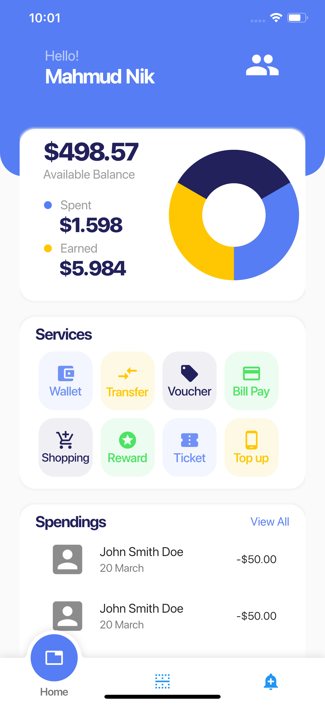
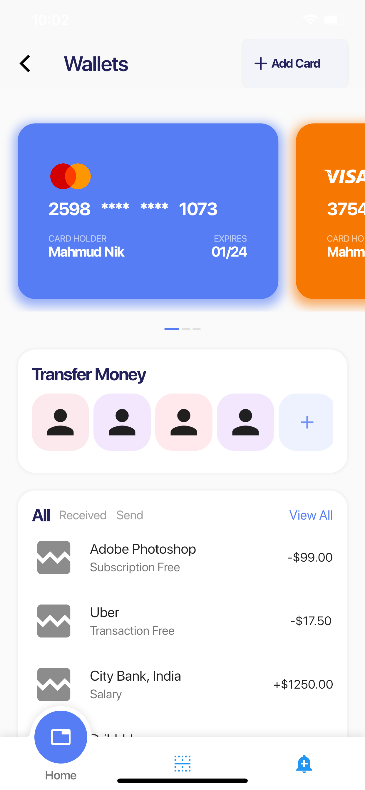

# Flutter Digital Wallet - Secure & Efficient Transactions 💳

## 📌 Description
Flutter Digital Wallet is a **modern financial application** built with **Flutter**, designed to provide users with a seamless and secure way to manage transactions, store digital assets, and process payments efficiently.

## 🎯 Project Objectives
- **Enable secure transactions** with encryption and authentication.
- **Provide an intuitive UI** for managing digital assets.
- **Optimize payment processing** for speed and reliability.

## 🔥 Key Features
- **Multi-currency support** for diverse financial needs.
- **Secure authentication** with biometric and PIN protection.
- **Transaction history tracking** for better financial management.

## 🛠️ Technologies Used
- **Frontend:** Flutter (Dart)
- **Backend:** Firebase / Node.js
- **Database:** Firestore / SQL-based storage
- **Version Control:** GitHub

## 🏗️ Installation & Setup
1. **Clone the repository:**
   ```bash
   git clone https://github.com/GJHR-6/Flutter-digitalWallet.git
<p>
  
   --- 
  
</p>

---

##### Reference: [Dribbble](https://dribbble.com/shots/10801116-Digital-Wallet-App)

---
